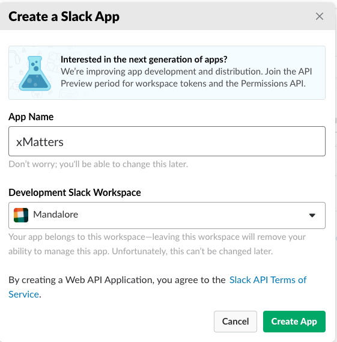
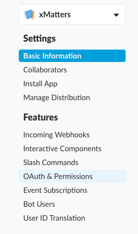
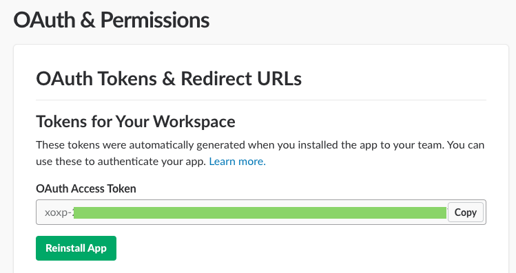

# Slack
This is part of the xMatters Labs awesome listing. Slack is a pretty sweet chat application with some great API hooks for integrations. This is a Script Library we put together to easily interact with the Slack API endpoints. 

:heavy_exclamation_mark: **Note:** We've launched a Slack bot for initiating events and getting real-time on-call info natively in Slack! Check it out [here](https://support.xmatters.com/hc/en-us/articles/209703083). The Shared Library below can still be useful if you want to create Slack channels or post messages into channels from *any* xMatters Comm Plan, so you can use them both to create some sweet hybrid chatopsy toolchainz!

:heavy_exclamation_mark: **Double Note**: You can get this same functionality using the awesome new Flow Designer without a line of code. Check it out [here](https://help.xmatters.com/ondemand/xmodwelcome/flowdesigner/slack-steps.htm)

---------

<kbd>
  
</kbd>

---------


# Pre-Requisites
* [Slack](https://slack.com/) account
* Existing communication plan - Use a packaged integration from the [integrations](https://www.xmatters.com/integrations) page, or [build your own](https://support.xmatters.com/hc/en-us/articles/202396229) 
* xMatters account - If you don't have one, [get one](https://www.xmatters.com)! 

# Files
* [Slack.js](Slack.js) - This is the code for the Shared Library that abstracts the interactions with Slack to a higher level. 

# Installation

## Slack
We will need to create a new application, which will generate a token for xMatters to use to authenticate into Slack. 
1. Navigate to the [Create a new app](https://api.slack.com/apps) screen and click the `Create New App` button. 
2. Give the app a descriptive name and select the appropriate Workspace:

<kbd>
  
</kbd>

3. Click the `OAuth & Permissions` feature in the left side menu:

<kbd>
	
</kbd>

4. Scroll down to Scopes and select the following permissions:
* channels:history
* channels:read
* channels:write
* team:read
* users:read
* chat:write:bot

5. Click `Save Changes`, then scroll up to `Install App to Workspace`. Click `Authorize` to install the app and generate a Token. Click the `Copy` button to copy the token to the clipboard. This will be used below. 

<kbd>
	
</kbd>

## xMatters
1. Log in to your xMatters instance as a user with the Developer role (or anyone with access to the target communication plan). On the Developer tab, click Edit > Integration Builder for the target communication plan. 
2. Click 'Edit Endpoints', and then click `Add Endpoint` to add an endpoint for Slack; fill out the following details:

   | Item | Selection |
   | ---- | --------- |
   | Name | Slack |
   | Base URL | https://slack.com/ |
   
3. Click Save and Close.
4. Click the `Edit Constants` button and `Add Constant`; fill out the following details to create a constant to hold the API key:

   | Item | Selection | 
   | ---- | --------- |
   | Name | Slack Token |
   | Value | TOKEN_VALUE_HERE |

Where TOKEN_VALUE_HERE is the Token from Slack in the steps above. 

5. Click `Save Changes` and `Close`.
5. Expand the Shared libraries section (if necessary) and click the `+ Add` button
6. Update the name at the top from `My Shared Library` to `Slack`, then paste in the contents of the [Slack.js](Slack.js) file and hit `Save`.

From here the next steps will depend on how xMatters will integrate to Slack. 

### Create a channel and include a link

One big use case is to create a Slack channel when the `Engage with xMatters` manual workflow is initiated. So, on an inbound integration script, add this scriptlet:

```
// Default the Join Chat link to hidden
data.properties.chat_link_disp = "none";

// Check if we should create a Slack channel
if( data.properties.task_chat_room == 'Slack' ) {
    var channel = Slack.createChannel( data.properties.number );
    var team    = Slack.getTeam();

    // Generate a link and set the Join Chat link element visible
    data.properties.chat_link = 'https://' + team.name + '.slack.com/messages/' + data.properties.number;
    data.properties.chat_link_disp = "visible";
}
```

The link is pretty easy to set up. In the `Show Source` on the message builder, build some html elements to show the link. The `div` tag allows us to set a style attribute, which we assign the `chat_link_disp` value. 
```
<tr style="border: solid 1px #e4e4e4; display: ${UUID_OF_CHAT_LINK_DISP}">
	 <td style="padding: 5px 10px;" tabindex="0">
	 	<a href="${UUID_OF_CHAT_LINK}">Join Chat</a>
	 </td>
</tr>
```

So when the event comes in, the `chat_link_disp` is set to `none` and the `Join Chat` link is hidden. If the incoming payload has the `task_chat_room` value set to `'Slack'` then create the room and set `chat_link_disp` to `visible`. 

### Pull chat history into a Service Desk application
Another common use case is to pull the history of a chat into a Service Desk ticket. For example, if the `Engage with xMatters` manual workflow was kicked off and a Slack channel was created to collaborate, then we can easily pull the chat history directly into the SD ticket. For example, on many of the [existing Service Desk](https://xmatters.com/integrations) integrations, there is a `Resolve` response option. When this is used, an outbound integration script could be triggered to pull the chat history of the corresponding Slack channel into the Service Desk ticket. 

1. Expand the Outbound Integrations section (if necessary) and click the `+ Add` button. (We are going to add a new script here, but don't worry: this will not impact any existing scripts. You can have several outbound integrations that all run on notification response, as long as you add logic to each one to determine if they should fire.) 
2. Fill out the following details in the wizard:

   | Item | Selection |
   | ---- | ---- |
   | Choose an action | Run a Script |
   | Select a form    | \<Choose the appropriate form> |
   | Select a trigger | Notification responses |
   | Integration name | \<Form name> - Outbound Response - Slack <br/> **Note** The Integration name format is arbitrary, but including the form name and `Slack` helps fellow developers see what a script does. |
6. Click Save and Open Script Editor. Leave the existing section that deals with the callback object and paste this scriptlet in:

   ```
   var Slack      = require( 'Slack' );

   if( callback.response.toLowerCase() == 'resolve' ) {
   
       StatusPage.updateStatusPageIncident( callback.eventProperties.number, "resolve" );
   
       var chatText = null;
       
       var room = callback.eventProperties.number;
       chatData = Slack.getRoomHistory( room.toLowerCase() );
       chatText = buildSlackText( chatData, room.toLowerCase() );

       if( chatText === null ) {           
           console.log( 'No Slack channel called "' + room + '" found. Finishing.' );
           return;
       }
           
       console.log( 'WORK NOTES: ' + chatText );
      
       var payload = {
           "work_notes": chatText
       };

       // Send Service Desk update here
   }

   ``` 

The `buildSlackText` function is going to differ based on the Service Desk platform. Here are a couple of examples we've put together. Note, this uses [momentjs](https://momentjs.com) to build the timestamp because working with dates in javascript is not fun. 

```
// buildSlackText for ServiceNow

function buildSlackText( data, room ) {
    
    if( !data )
		return "No Slack Text Found.";
	
	var team = Slack.getTeam();
    var slack_url = 'https://' + team.name + '.slack.com/messages/#' + room
    
    var text = '';
    text += '<h4> Slack Channel Transcript:</h4><br/>';
    text += '<a href="' + slack_url + '" target="_blank">Slack Channel ' + room + '</a><br/>';


    console.log( 'SlackText: ' + data );
    
    // Sort on the ts field
	data.sort(function(a, b) {
	    return parseFloat(a.ts) - parseFloat(b.ts);
	});
	
	
	var userMap = {};
	
	
	var textArr = data.map( function( item ) {
		
		var date = moment( item.ts * 1000 ).tz('America/Los_Angeles').format( 'MMM D hh:mm a z' );
	
		var str = '';
		str += '' + date + ' ';
	
		// Slack reports the ID of the users in the messages,
		// and not the username. Instead of trying to make HTTP
		// calls for each message to get the username, we'll 
		// store it and reference.
		if( item.subtype && item.subtype == 'channel_join' ) {
			temp = item.text.split( /<@(.*)\|(.*)>/ );
			userMap[ temp[1] ] = temp[2];
			console.log( 'Added User: ' + temp[2] + '. userMap: ' + JSON.stringify( userMap ) );
		}
		
		// If they aren't in the map for some reason,
		// go get them. 
		if( !userMap[ item.user ] ) {
		    var userinfo = Slack.getUserInfo( item.user );
		    userMap[ item.user ] = userinfo.name;
		}
	
		str += '<b><i>' + ( userMap[ item.user ] || item.user ) + '</i></b>';
		str += ': ' + item.text;
	
		return str;
	
	});
	
	console.log( 'Text: ' + textArr.join( "\n" ) );
	return '[code]' + text + textArr.join( "<br/>" ) + '[/code]';
    
}

```

# Testing

## Create a channel and include a link

To test this one, send a request to the inbound integration endpoint and make sure to populate the `task_chat_room` property with `'Slack'`, or update the script to reflect the desired value. When the request comes in, a new Slack channel will be created with a name of the value in `data.properties.number`. 

## Pull chat history into a Service Desk application

For testing this one, respond with `Resolve` to an event, then check the Service Desk ticket for the chat history details. 
